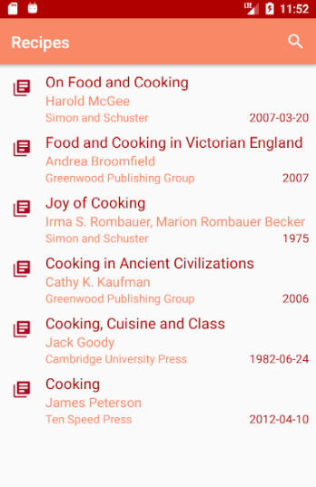
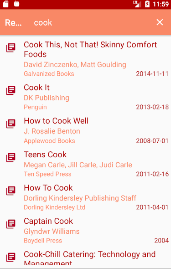

# Recipies Android mobile application

###### Author: Oana Caplescu

#### Project done while studying Mobile Operating course during the SCPD Master program

This project was build using Android Studio :+1: and tested throught development using an Android emulator :iphone:.

The data which is being used to populate the application is being retrieved from [Google's Books API](https://developers.google.com/books/) by making calls to the API using a [Google developer's authetification KEY](https://cloud.google.com/docs/authentication/api-keys). :point_up:

The application has muliple user experience improvements :telephone_receiver: such as showing a progress bar when the data is being loaded for displaying or showing various error messages if the data cannot be displayed (for example the device is on airplane mode). 

The layout which is being used is called _Recycler view_ for caching data and reusing existing views - when scrolling is being done (for example) and new data needs to be loaded, this view is authomatically filling the elements in the UI with new data, thus optimizing the app using caching. :raised_hands: 

This is achieved by using am Adapter which gathers the data (from the Google API, in this case) and comunicates directly to a ViewHolder which asks for needed data from the Adapter and displays it accordingly. A custom Adapter and a ViewHolder were created for this mobile application, in order for the RecyclerView to be used. :computer:

Some screenshots of the app can be seen here :iphone:

 
